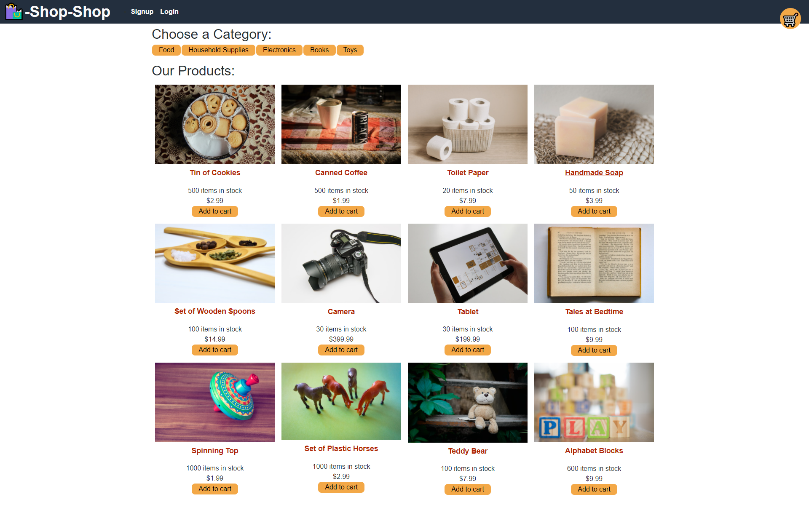

# SHOP SHOP

## Description:
Shop Shop is an e-commerce application that allows users to shop for various items, add these products to the shopping cart, manage the shopping cart by increasing and decreasing quantities, checkout their purchases and see their order history. Global State control is made using REDUX.

## Table of Contents

* [Technology](#technology)
* [App-Screenshot](#App-Screenshot)
* [Installation](#installation)
* [Contribution](#contribution)
* [License](#license)
* [Questions](#questions)

## Technology:
- MongoDB
- Express.js
- React.js
- Node.js
- Heroku
- Redux

## App-Screenshot

## Installation
No installation prodecures. App is online.

## Link to Deployed Application
https://shop-shop-redux-hbbc248.herokuapp.com/

## Contribution
Anybody is free to contribute to this project as desired. Just contact me via email to present your new ideas to add to this project.

## License
This project was done under the MIT license to know more about it, please click here: [MIT](https://choosealicense.com/licenses/mit/)

## Questions
Please visit my GitHub page: https://github.com/hbbc248
  
For more information please email me at: ibrahimzerlin@hotmail.com